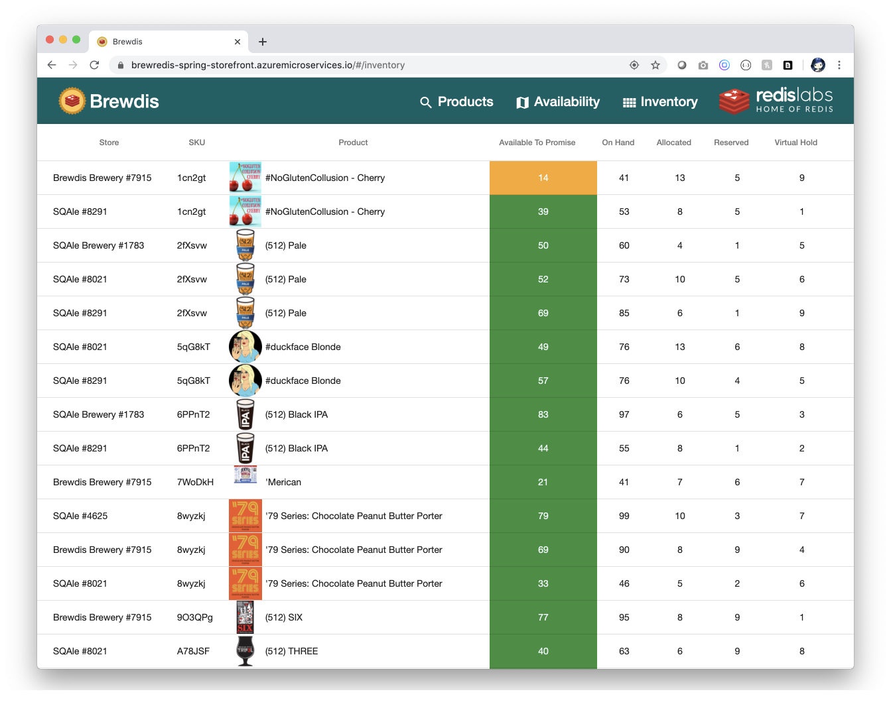
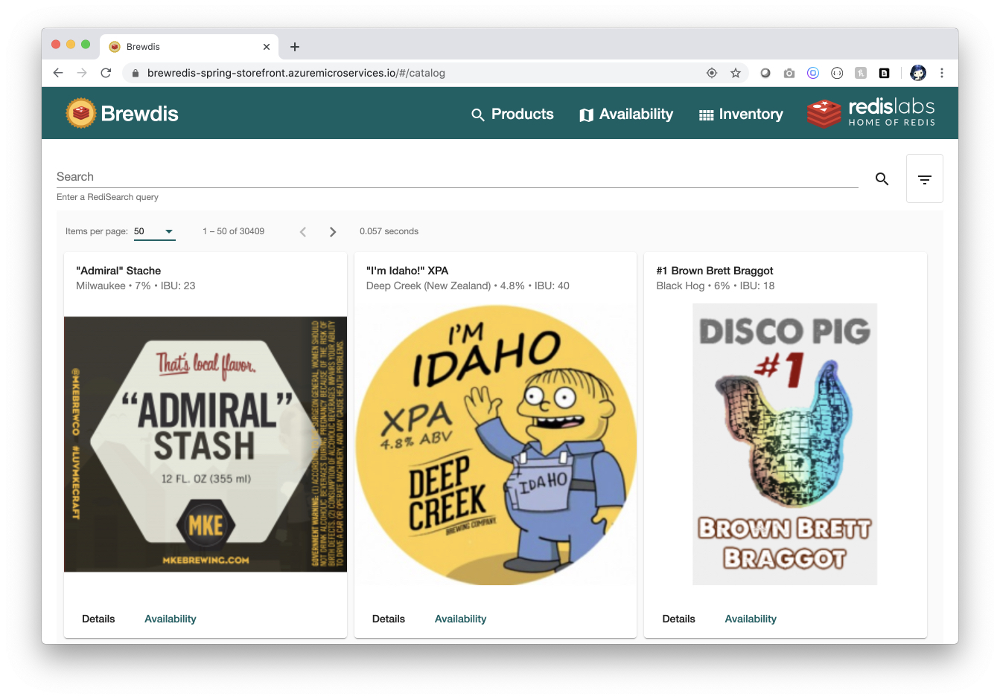
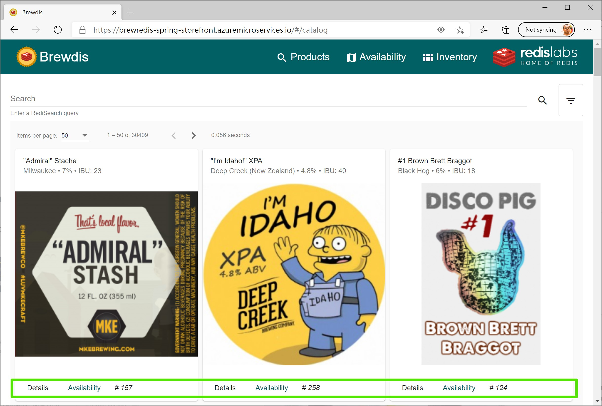
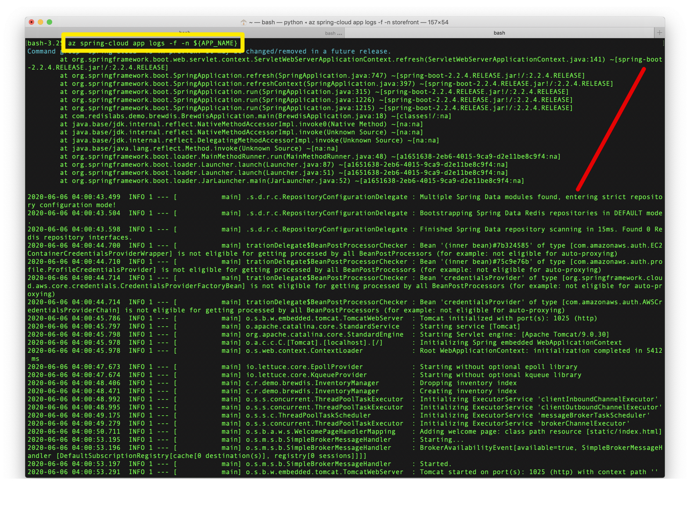

# Deploy Spring Boot app using Azure Spring Cloud and Redis Enterprise 

Azure Spring Cloud enables you to easily run a Spring Boot based microservices application on Azure.

This quickstart shows you how to deploy an existing Java Spring Cloud application to Azure. When you're finished, you can continue to manage the application via the Azure CLI or switch to using the Azure portal.

## What will you experience
You will:
- Build an existing application locally
- Provision an Azure Spring Cloud service instance
- Deploy the application to Azure
- Open the application

## What you will need

In order to deploy a Java app to cloud, you need 
an Azure subscription. If you do not already have an Azure 
subscription, you can activate your 
[MSDN subscriber benefits](https://azure.microsoft.com/pricing/member-offers/msdn-benefits-details/) 
or sign up for a 
[free Azure account]((https://azure.microsoft.com/free/)).

In addition, you will need the following:

| [Azure CLI version 2.0.67 or higher](https://docs.microsoft.com/cli/azure/install-azure-cli?view=azure-cli-latest) 
| [Java 11](https://www.azul.com/downloads/azure-only/zulu/?version=java-11-lts&architecture=x86-64-bit&package=jdk) 
| [Gradle](https://gradle.org/install/) 
| [Git](https://git-scm.com/)
|

Create an instance of Azure Cache for Redis Enterprise:
| [Step-by-step directions](https://docs.microsoft.com/en-us/azure/azure-cache-for-redis/quickstart-create-redis-enterprise)
| [Start here https://aka.ms/redis-enterprise which includes preview feature flag](https://aka.ms/redis-enterprise)
|

## Install the Azure CLI extension

Install the Azure Spring Cloud extension for the Azure CLI using the following command

```bash
    az extension add --name spring-cloud
```

## Clone and build the repo

### Create a new folder and clone the sample app repository to your Azure Cloud account  

```bash
    mkdir source-code
    git clone https://github.com/selvasingh/brewdis
```

### Change directory and build the project

```bash
    cd brewdis
    ./gradlew build
```
This will take a few minutes.

## Provision Azure Spring Cloud service instance using Azure CLI

### Prepare your environment for deployments

Create a bash script with environment variables by making a copy of the supplied template:
```bash
    cp .scripts/setup-env-variables-azure-template.sh .scripts/setup-env-variables-azure.sh
```

Open `.scripts/setup-env-variables-azure.sh` and enter the following information:

```bash
    export SUBSCRIPTION=subscription-id # customize this
    export RESOURCE_GROUP=resource-group-name # customize this
    ...
    export SPRING_CLOUD_SERVICE=azure-spring-cloud-name # customize this
    ...
    export SPRING_REDIS_HOST=redis-server-host # customize this
    export SPRING_REDIS_PASSWORD=redis-password # customize this
```

Then, set the environment:
```bash
    source .scripts/setup-env-variables-azure.sh
```

### Login to the Azure CLI 
Login to the Azure CLI and choose your active subscription. Be sure to choose the active subscription that is whitelisted for Azure Spring Cloud

```bash
    az login
    az account list -o table
    az account set --subscription ${SUBSCRIPTION}
```

### Create Azure Spring Cloud service instance
Prepare a name for your Azure Spring Cloud service.  The name must be between 4 and 32 characters long and can contain only lowercase letters, numbers, and hyphens.  The first character of the service name must be a letter and the last character must be either a letter or a number.

Create a resource group to contain your Azure Spring Cloud service.

```bash
    az group create --name ${RESOURCE_GROUP} \
        --location ${REGION}
```

Create an instance of Azure Spring Cloud.

```bash
    az spring-cloud create --name ${SPRING_CLOUD_SERVICE} \
        --resource-group ${RESOURCE_GROUP} \
        --location ${REGION}
```

The service instance will take around five minutes to deploy.

Set your default resource group name and cluster name using the following commands:

```bash
    az configure --defaults \
        group=${RESOURCE_GROUP} \
        location=${REGION} \
        spring-cloud=${SPRING_CLOUD_SERVICE}
```

## Create a microservice application

Create Spring Cloud microservice `retail` app.

```bash
    az spring-cloud app create --name ${APP_NAME} --instance-count 1 --is-public true \
        --memory 2 \
        --runtime-version Java_11 \
        --jvm-options='-Xms2048m -Xmx2048m'
```

## Deploy application and set environment variables

Deploy the application to Azure.

```bash
    az spring-cloud app deploy --name ${APP_NAME} \
        --jar-path ${BREWDIS_JAR} \
        --env SPRING_REDIS_HOST=${SPRING_REDIS_HOST} \
              SPRING_REDIS_PASSWORD=${SPRING_REDIS_PASSWORD} \
              SPRING_REDIS_PORT=${SPRING_REDIS_PORT} \
              STOMP_HOST=${STOMP_HOST} \
              STOMP_PORT=${STOMP_PORT}
```

```bash
    az spring-cloud app show --name ${APP_NAME} | grep url
```

Navigate to the URL provided by the previous command to open the brewdis application.
    



## Market Targeting

When viewing the application you will find that if you are a user of the Edge browser, then you will see the availability count shown on the catalog page. We are testing out this new feature, and to start with we are just targeting users of the Edge browser.

```java
boolean showAvailabilityCount = featureManager.isEnabledAsync("beta").block();
```

This is done by using a Feature Flag and a Feature Filter to check which browser is being used. This is a custom Feature Filter that was designed to target 1 of 3 browsers, Edge, Firefox, and Chrome, depending on the configuration.

```java
public class BrowserFilter implements FeatureFilter {

    @Autowired
    private HttpServletRequest request;

    @Override
    public boolean evaluate(FeatureFilterEvaluationContext context) {
        String userAgent = request.getHeader(USERAGENT);
        String browser = (String) context.getParameters().get(BROWSER);
        if (userAgent.contains(EDGE_USERAGENT) && browser.equals(EDGE_BROWSER)) {
            return true;
        } else if (userAgent.contains(FIREFOX_USERAGENT) && browser.equals(FIREFOX_BROWSER)) {
            return true;
        } else if (userAgent.contains(CHROME_USERAGENT) && !userAgent.contains(EDGE_USERAGENT)
                && browser.equals(CHROME_BROWSER)) {
            return true;
        }
        return false;
    }
}
```


Additional information on how to use Feature Flags can be found [here](https://docs.microsoft.com/azure/azure-app-configuration/use-feature-flags-spring-boot).

## Open logstream

You can open the log stream from your development machine.

```bash
    az spring-cloud app logs -f -n ${APP_NAME}
```


## Next Steps

In this quickstart, you've deployed an existing Spring Boot application using Azure CLI. To learn more about Azure Spring Cloud, go to:

- [Azure Spring Cloud](https://azure.microsoft.com/en-us/services/spring-cloud/)
- [Azure Spring Cloud docs](https://docs.microsoft.com/en-us/azure/java/)
- [Deploy Spring microservices from scratch](https://github.com/microsoft/azure-spring-cloud-training)
- [Deploy existing Spring microservices](https://github.com/Azure-Samples/azure-spring-cloud)
- [Azure for Java Cloud Developers](https://docs.microsoft.com/en-us/azure/java/)
- [Spring Cloud Azure](https://cloud.spring.io/spring-cloud-azure/)
- [Spring Cloud](https://spring.io/projects/spring-cloud)